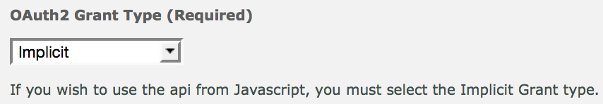

# dAmn
[](https://circleci.com/gh/n6g7/damn) [](https://www.bithound.io/github/n6g7/damn)

Node.js DeviantArt API client

## Quick start

Install:

```shell
yarn add damn
```

```js
const Damn = require('damn');

const clientId = 1234
const clientSecret = 'thisissecret'

Damn.clientCredentials(clientId, clientSecret)
.then(damn => damn.getDailyDeviations())
.then(dailyDeviations => {
  ...
})

```

## Client generation

dAmn currently supports two [authentication methods](https://www.deviantart.com/developers/authentication): *Client Credentials* and *Implicit*.
Both provide access to public endpoints but only the *Implicit* method grants access to user-specific APIs.

Both methods require a `client_id` and a `client_secret` to be granted an access token. These are obtained by creating an app in [DeviantArt's application page](https://www.deviantart.com/developers/apps).

### Public API
The easiest way to access public API is to use the *Client Credentials* method, which is available via `Damn.clientCredentials`:

```js
Damn.clientCredentials('4321', 'cl13nt_s3cr3t')
.then(damn => {
  damn.getDailyDeviations()
  [...]
})
```

Where `4321` is your `client_id` and `cl13nt_s3cr3t` is your `client_secret`.

The `Damn.clientCredentials()` call returns a promise which resolves to a `Damn` object, from which you can call the methods marked *public* described below.

### Logged-in API
Accessing user-specific endpoints can only be done when using the *Implicit* authentication method. This methods requires you to provide an username, a password, a `client_id` and a `redirect_uri` for the application you created.

If you're using this method, make sure your "OAuth2 Grant Type" settings is set to "Implicit" in your application parameters:


To instanciate a "private" client you may use the `Damn.implicit` method:

```js
const clientId = 1234
const redirectUri = 'https://www.example.com'
const username = 'toto'
const password = 'h4xXx0r'
const scope = 'basic'

Damn.implicit(clientId, redirectUri, username, password, scope)
.then(damn => {
  damn.getDailyDeviations()
  [...]
})
```

The `Damn.implicit()` call returns a promise which resolves to a `Damn` object, from which you can call all the methods described below.


## Methods

All these methods are asynchronous and return promises.

### getDailyDeviations()

> Public endpoint

Returns the list of today's [daily deviations](http://www.deviantart.com/dailydeviations/):

```js
damn.getDailyDeviations
.then(dailyDeviations => {
  ...
})
```

### getNotifications()

> Private endpoint

Returns the list of current user notifications:

```js
damn.getNotifications
.then(notifications => {
  ...
})
```

### getWatchFeed()

> Private endpoint

Returns the current user's watch feed:

```js
damn.getWatchFeed
.then(feed => {
  ...
})
```

### getDeviation(*deviationId*)

> Public endpoint

Returns the details of a specific deviation:

```js
const deviationId = 12345

damn.getDeviation(deviationId)
.then(deviation => {
  ...
})
```

**Parameters**:
 - `deviationId` (string): the deviation id.

### placebo()

> Public endpoint

Implementation of DA's [placebo](https://www.deviantart.com/developers/http/v1/20150824/placebo/53b9f8bd16df06555acb1dfc06e6df69) route. Use it to check you access token validity. Or better yet, use `checkAccessToken()`!

```js
damn.placebo.then(placebo => {
  ...
})
```

### checkAccessToken()

Check the validity of your access token, returns a boolean.

```js
damn.checkAccessToken.then(validToken => {
  ...
})
```

## Todo

 - [X] Use [Node.js v4.0.0](https://github.com/nodejs/node/blob/v4.0.0/CHANGELOG.md) and ES6 features
 - [ ] Automate token refresh
 - [X] Setup linter
 - [ ] Add access to the following routes:
  - [X] `/deviation/{deviationid}` Fetch a deviation
  - [ ] `/deviation/content` Fetch full data that is not included in the main devaition object
  - [ ] `/browse/morelikethis` Fetch MoreLikeThis result for a seed deviation
  - [ ] `/browse/newest` Browse newest deviations
  - [ ] `/browse/popular` Browse popular deviations
  - [ ] `/browse/hot` Browse whats hot deviations
  - [ ] and all others routes ?
 - [ ] Revoke access / logout
 - [ ] Find a way to implement [Authorization Code](https://www.deviantart.com/developers/authentication) as an authentication method
